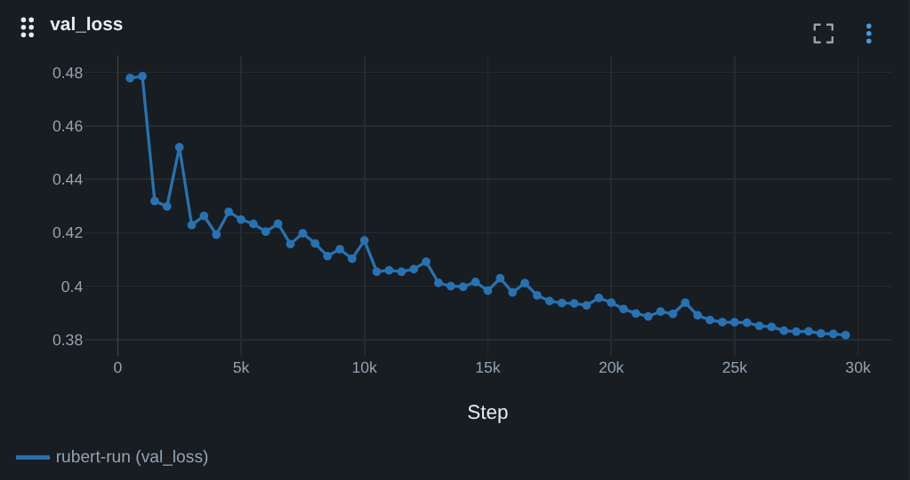
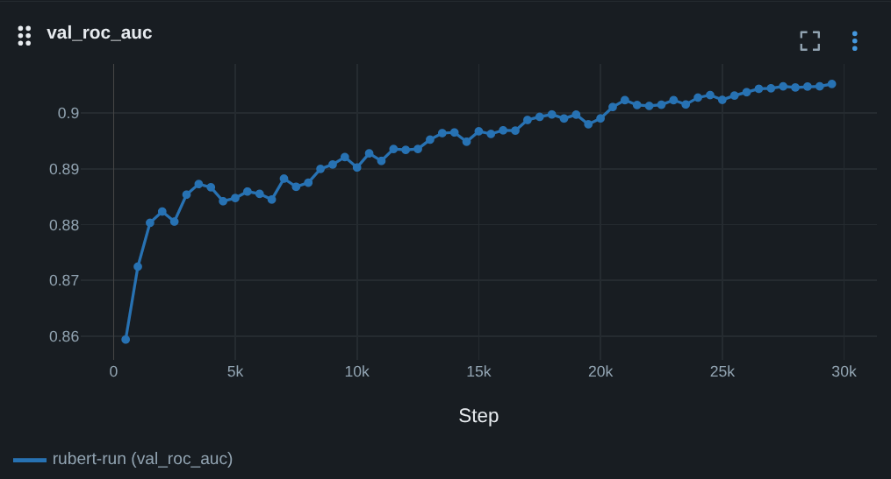

# Turn Detection для голосовых ботов

## Описание проекта

Для голосовых ботов на базе LLM важно уметь распознать момент когда пользователь закончил говорить и боту нужно начать отвечать, а когда пользователь задумался на середине фразы или еще не успел ее закончить - тогда нужно подождать. Задача заключается в том, чтобы классифицировать префикс фразы клиента (на русском языке) на 2 класса: speak (positive) и wait (negative).

### Данные

За основу взят датасет диалогов [inkoziev/Conversations](https://huggingface.co/datasets/inkoziev/Conversations). Также поддерживается возможность дообучения на собственных данных в диалоговом формате.

### Модель

Используется [deepvk/RuModernBERT-base](https://huggingface.co/deepvk/RuModernBERT-base)

### Метрики

| Метрика  | Значение |
| -------- | -------- |
| ROC-AUC  | > 0.9    |
| F1-score | > 0.84   |

на отложенной выборке из того же датасета.





## Setup

### Установка

Проект использует uv для управления зависимостями.

1. Установка зависимостей:

```bash
uv sync --extra cpu
```

или

```bash
uv sync --extra cuda
```

2. Установка pre-commit хуков:

```bash
pre-commit install
```

### DVC

Используется DVC для хранения данных и моделей, в качестве удаленного хранилища используется Google Drive.

```bash
uv run dvc pull
```

Правда для этого необходимо авторизоваться. Обучение можно запустить и без этого, необходимые данные скачаются с huggingface.

### MLflow

Для логирования используется MLflow

```bash
uv run mlflow server --host 127.0.0.1 --port 8080
```

---

## Train

Базовая команда для обучения:

```bash
uv run python -m turn_detection.commands train
```

Для удобства используются конфиги экспериментов в [configs/experiments](./configs/experiment):

```bash
uv run python -m turn_detection.commands train --experiment rubert
```

В процессе обучения чекпоинты сохраняются в `checkpoints/run_name`, метрики, гиперпараметры и id коммита логируются в MLflow.

## Infer

### Простой инференс

```bash
uv run python -m turn_detection.commands infer /path/to/data.json /path/to/ckpt --model=rubert
```

Пример данных для инференса находится в `data/sample_inference.json` (не в DVC так как маленький не меняющийся файл).

На выходе получается json файл с предсказаниями формата

```json
{
    "context": "Ну нас есть несколько вариантов",
    "message": "хорошо а",
    "probas": {
      "wait": 0.9750620722770691,
      "speak": 0.024937964975833893
    }
  },
```

### Экспорт модели в ONNX

После обучения модель можно экспортировать в ONNX:

```bash
uv run python -m turn_detection.commands export_onnx /path/to/ckpt --model=rubert
```

**Замечание**: токенайзер не экспортируется в ONNX, а каждый раз загружается из HF отдельно

### Конвертация в TensorRT

```bash
scripts/convert_to_tensorrt.sh
```

### Triton Inference Server

Запуск сервера (для этого необходим model.plan скачанный с DVC или созданный на предыдущем шаге):

```bash
docker compose up -d
```

Запуск FastAPI сервера:

```
python -m turn_detection.serve
```

(параметры находятся в `configs/serve/default.yaml`)

После этого можно делать запросы на `http://localhost:9090/infer`

### Пример запроса к API

```bash
curl -X POST http://localhost:9090/infer \
    -H "Content-Type: application/json" \
    -d '{"context": "алло", "message": "как вас"}'
```

Response:

```json
{ "probas": { "wait": 0.9544147849082947, "speak": 0.04558521881699562 } }
```
